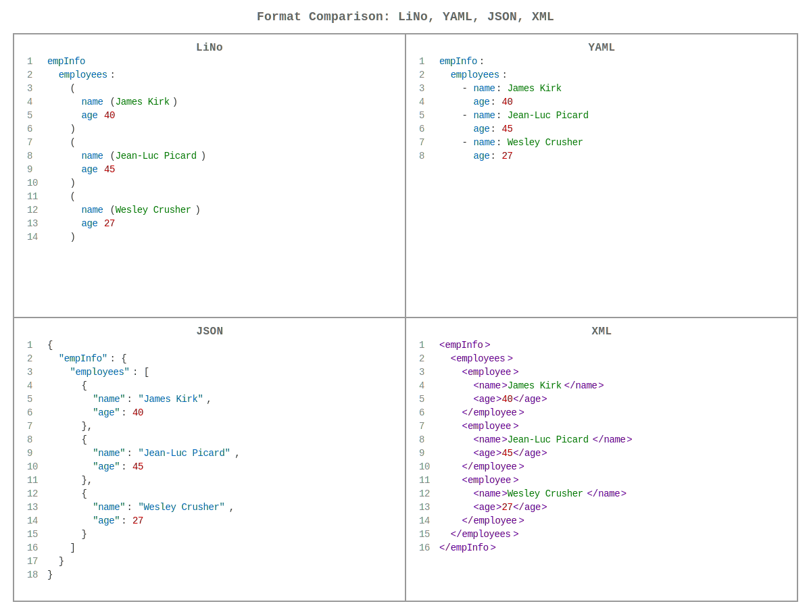

# [links-notation](https://github.com/link-foundation/links-notation) (languages: en • [ru](README.ru.md))

| [](https://github.com/link-foundation/links-notation/actions?workflow=js) | [](https://www.npmjs.com/package/links-notation) | **[JavaScript](js/README.md)** |
|:-|-:|:-|
| [](https://github.com/link-foundation/links-notation/actions?workflow=rust) | [](https://crates.io/crates/links-notation) | **[Rust](rust/README.md)** |
| [](https://github.com/link-foundation/links-notation/actions?workflow=csharp) | [](https://www.nuget.org/packages/Link.Foundation.Links.Notation) | **[C#](csharp/README.md)** |
| [](https://github.com/link-foundation/links-notation/actions?workflow=python) | [](https://pypi.org/project/links-notation/) | **[Python](python/README.md)** |
| [](https://github.com/link-foundation/links-notation/actions?workflow=go) | [](https://pkg.go.dev/github.com/link-foundation/links-notation/go) | **[Go](go/README.md)** |
| [](https://github.com/link-foundation/links-notation/actions?workflow=java) | [](https://central.sonatype.com/artifact/io.github.link-foundation/links-notation) | **[Java](java/README.md)** |

[](https://gitpod.io/#https://github.com/link-foundation/links-notation)
[](https://github.com/codespaces/new?hide_repo_select=true&ref=main&repo=link-foundation/links-notation)

[](https://app.codacy.com/gh/link-foundation/links-notation?utm_source=github.com&utm_medium=referral&utm_content=link-foundation/links-notation&utm_campaign=Badge_Grade_Settings)
[](https://www.codefactor.io/repository/github/link-foundation/links-notation)

Link Foundation's Links Notation Class Library.



This library gives you an ability to convert any string that contains
links notation into a list of links and back to the string after
modifications are made.

Links notation is based on two concepts references and links. Each
reference references other link. The notation supports links with any
number of references to other links.

## Quick Start

### C&#35;

```csharp
var parser = new Link.Foundation.Links.Notation.Parser();
var links = parser.Parse("papa (lovesMama: loves mama)");
```

### JavaScript

```javascript
import { Parser } from 'links-notation';
const parser = new Parser();
const links = parser.parse("papa (lovesMama: loves mama)");
```

### Rust

```rust
use links_notation::parse_lino;
let links = parse_lino("papa (lovesMama: loves mama)").unwrap();
```

### Python

```python
from links_notation import Parser
parser = Parser()
links = parser.parse("papa (lovesMama: loves mama)")
```

### Go

```go
import lino "github.com/link-foundation/links-notation/go"
links, _ := lino.Parse("papa (lovesMama: loves mama)")
```

### Java

```java
import io.github.linkfoundation.linksnotation.Parser;
Parser parser = new Parser();
List<Link> links = parser.parse("papa (lovesMama: loves mama)");
```

## Examples

### Links notation (lino)

#### Doublets (2-tuple)

```lino
papa (lovesMama: loves mama)
son lovesMama
daughter lovesMama
all (love mama)
```

#### Triplets (3-tuple)

```lino
papa has car
mama has house
(papa and mama) are happy
```

#### Sequences (N-tuple)

```lino
I'm a friendly AI.
(I'm a friendly AI too.)
(linksNotation: links notation)
(This is a linksNotation as well)
(linksNotation supports (unlimited number (of references) in each link))
(sequence (of references) surrounded by parentheses is a link)
parentheses may be ommitted if the whole line is a single link
```

#### Indented Syntax

Links can also use indented syntax for better readability:

```lino
3:
  papa
  loves
  mama
```

This is equivalent to:

```lino
(3: papa loves mama)
```

So that means that *this* text is also links notation. So most of the
text in the world already may be parsed as links notation. That makes
links notation the most easy an natural/intuitive/native one.

## What is Links Notation?

Links Notation (Lino) is a simple, intuitive format for representing
structured data as links between ~~entities~~ references to links.
It's designed to be:

- **Natural**: Most text can already be parsed as links notation
- **Flexible**: Supports any number of references in each link  
- **Universal**: Can represent doublets, triplets, and N-tuples
- **Hierarchical**: Supports nested structures with indentation

The notation uses two core concepts:

- **References**: Points to other links (like variables or identifiers)
- **Links**: Connect references together with optional identifiers

## Documentation

For detailed implementation guides and API references, see the
language-specific documentation:

- **[C# Documentation](https://link-foundation.github.io/links-notation/csharp/api/Link.Foundation.Links.Notation.html)**
  \- Complete API reference
- **[C# README](csharp/README.md)** - Installation and usage guide
- **[JavaScript README](js/README.md)** - Modern web development guide
- **[Rust README](rust/README.md)** - High-performance parsing guide
- **[Python README](python/README.md)** - Python package guide
- **[Go README](go/README.md)** - Go package guide
- **[Java README](java/README.md)** - Java/Maven package guide

Additional resources:

- [Test Case Comparison](TEST_CASE_COMPARISON.md) - Comprehensive test coverage comparison across all 6 language implementations
- [PDF Documentation](https://link-foundation.github.io/links-notation/csharp/Link.Foundation.Links.Notation.pdf)
  \- Complete reference for offline reading
- [Links Theory 0.0.2](https://habr.com/en/articles/895896) - Theoretical
  foundation that Links Notation fully supports

## Test Coverage & Implementation Parity

All six language implementations (C#, JavaScript, Rust, Python, Go, Java) maintain **equivalent core functionality** with comprehensive test coverage:

- **Python**: 108 tests across 10 categories - All passing ✅
- **JavaScript**: 109 tests across 11 categories - All passing ✅
- **Rust**: 110 tests across 11 categories - All passing ✅
- **C#**: 111 tests across 12 categories - All passing ✅
- **Go**: 90+ tests across 10 categories - All passing ✅
- **Java**: 117 tests across 7 categories - All passing ✅

**90+ tests match identically** across all languages, verifying functional equivalence. See [TEST_CASE_COMPARISON.md](TEST_CASE_COMPARISON.md) for the complete cross-language test comparison with links to source code.

### Known Implementation Differences

Some language-specific features are documented as intentional:

- **Python**: Does not implement `LinksGroup` or multiline quoted strings
- **JS/Rust/C#**: Do not implement Python's `FormatConfig` feature
- **C# Only**: Supports tuple conversion (C#-specific feature)

These differences are by design and do not affect core parsing/formatting functionality.
