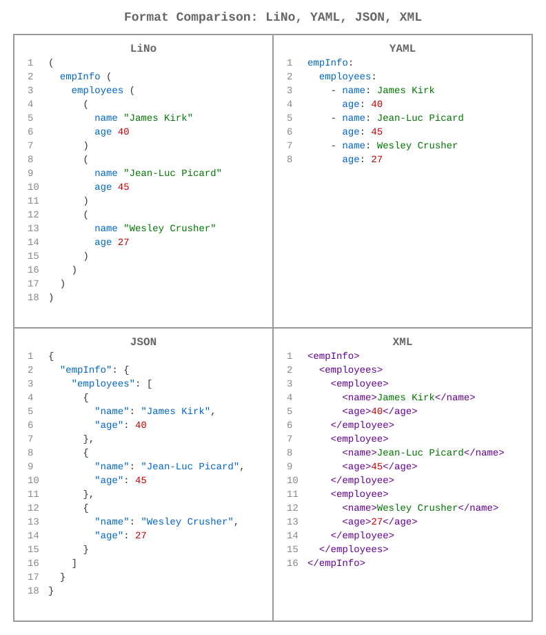

# [links-notation](https://github.com/link-foundation/links-notation) (languages: [en](README.md) • ru)

| [](https://github.com/link-foundation/links-notation/actions?workflow=js) | [](https://www.npmjs.com/package/links-notation) | **[JavaScript](js/README.ru.md)** |
|:-|-:|:-|
| [](https://github.com/link-foundation/links-notation/actions?workflow=rust) | [](https://crates.io/crates/links-notation) | **[Rust](rust/links-notation/README.ru.md)** |
| [](https://github.com/link-foundation/links-notation/actions?workflow=csharp) | [](https://www.nuget.org/packages/Link.Foundation.Links.Notation) | **[C#](csharp/README.ru.md)** |
| [](https://github.com/link-foundation/links-notation/actions?workflow=python) | [](https://pypi.org/project/links-notation/) | **[Python](python/README.ru.md)** |
| [](https://github.com/link-foundation/links-notation/actions?workflow=java) | [](https://central.sonatype.com/artifact/io.github.link-foundation/links-notation) | **[Java](java/README.ru.md)** |
| [](https://github.com/link-foundation/links-notation/actions?workflow=php) | [](https://packagist.org/packages/link-foundation/links-notation) | **[PHP](php/README.ru.md)** |

[](https://gitpod.io/#https://github.com/link-foundation/links-notation)
[](https://github.com/codespaces/new?hide_repo_select=true&ref=main&repo=link-foundation/links-notation)

[](https://app.codacy.com/gh/link-foundation/links-notation?utm_source=github.com&utm_medium=referral&utm_content=link-foundation/links-notation&utm_campaign=Badge_Grade_Settings)
[](https://www.codefactor.io/repository/github/link-foundation/links-notation)

Библиотека классов Link Foundation Link.Foundation.Links.Notation.



Эта библиотека дает вам возможность преобразовать любую строку,
содержащую обозначение связей, в список связей и форматировать этот
список обратно в строку после внесения изменений.

Нотация связей основана на двух концепциях: ссылка и связь. Каждая
ссылка ссылается на другую связь. Нотация поддерживает связи с любым
количеством ссылок на другие связи.

## Быстрый старт

### C&#35;

```csharp
var parser = new Link.Foundation.Links.Notation.Parser();
var links = parser.Parse("папа (любитМаму: любит маму)");
```

### JavaScript

```javascript
import { Parser } from 'links-notation';
const parser = new Parser();
const links = parser.parse("папа (любитМаму: любит маму)");
```

### Rust

```rust
use links_notation::parse_lino;
let links = parse_lino("папа (любитМаму: любит маму)").unwrap();
```

### Python

```python
from links_notation import Parser
parser = Parser()
links = parser.parse("папа (любитМаму: любит маму)")
```

### Java

```java
import io.github.linkfoundation.linksnotation.Parser;
Parser parser = new Parser();
List<Link> links = parser.parse("папа (любитМаму: любит маму)");
```

### PHP

```php
use LinkFoundation\LinksNotation\Parser;
$parser = new Parser();
$links = $parser->parse("папа (любитМаму: любит маму)");
```

## Примеры

### Нотация связей

#### Дуплеты (2-кортежи)

```lino
папа (любитМаму: любит маму)
сын любитМаму
дочь любитМаму
все (любят маму)
```

#### Триплеты (3-кортежи)

```lino
папа имеет машину
мама имеет дом
(папа и мама) счастливы
```

#### Последовательности (N-кортежи)

```lino
Я дружелюбный ИИ.
(Я тоже дружелюбный ИИ.)
(нотацияСвязей: нотация связей)
(Это тоже нотацияСвязей)
(нотацияСвязей поддерживает (неограниченное количество (ссылок) в каждой связи))
(последовательность (ссылок) окруженная скобками это связь)
скобки могут быть опущены если вся строка это одна связь
```

#### Синтаксис с отступами

Связи также могут записываться с отступами, для лучшей читаемости:

```lino
3:
  papa
  loves
  mama
```

Это эквивалентно записи:

```lino
(3: papa loves mama)
```

#### Многострочные группы

Скобочная группа открывает *вложенный контекст*: её тело начинается заново с
нулевого уровня отступа и подчиняется тем же правилам, что и корень документа,
поэтому перенос строки внутри скобок — это структура, а не оформление.

```lino
value (
  id "1"
  label "one"
)
```

Читается как `(value ((id 1) (label one)))` — два потомка, каждый из которых
сам является связью, — а не как один плоский список, в котором граница между
`id` и `label` была бы потеряна. Отступы внутри группы работают ровно так же,
как в корне, а тело, умещающееся в одну строку, по-прежнему сворачивается в
одну связь, так что `(a b c)` не меняется.

Все семь реализаций читают это одинаково. `experiments/issue-282/parity`
разбирает приведённый выше документ каждой из них и падает, если хотя бы одна
прочитает его иначе. Полные правила описаны в
[грамматике](docs/grammar/GRAMMAR.md).

Это означает что *этот* текст тоже является нотацией связей. Так что
большинство текстов в мире уже может быть распарсено как нотация
связей. Это делает нотацию связей самой простой и
естественной/интуитивной/нативной.

## Что такое Нотация Связей?

Нотация Связей (Lino) - это простой, интуитивный формат для
представления структурированных данных в виде связей между
~~сущностями~~ ссылками на связи. Он разработан для того, чтобы быть:

- **Естественным**: Большинство текстов уже может быть распарсено как нотация связей
- **Гибким**: Поддерживает любое количество ссылок в каждой связи  
- **Универсальным**: Может представлять дублеты, триплеты и N-кортежи
- **Иерархическим**: Поддерживает вложенные структуры с отступами

Нотация использует две основные концепции:

- **Ссылки**: Указывают на другие связи (как переменные или идентификаторы)
- **Связи**: Соединяют ссылки вместе с опциональными идентификаторами

## Документация

Для подробных руководств по реализации и справочников API смотрите
документацию для конкретных языков:

- **[Документация C#](https://link-foundation.github.io/links-notation/csharp/api/Link.Foundation.Links.Notation.html)**
  \- Полный справочник API
- **[PDF Документация](https://link-foundation.github.io/links-notation/csharp/Link.Foundation.Links.Notation.pdf)**
  \- Полный справочник для офлайн чтения
- **[README C#](csharp/README.ru.md)** - Руководство по установке и использованию
- **[README JavaScript](js/README.ru.md)** - Руководство для современной
  веб-разработки
- **[README Rust](rust/links-notation/README.ru.md)** - Руководство по
  высокопроизводительному парсингу
- **[README Python](python/README.ru.md)** - Руководство по работе с пакетом Python
- **[README Go](go/README.ru.md)** - Руководство по работе с пакетом Go
- **[README Java](java/README.ru.md)** - Руководство по работе с пакетом Java/Maven
- **[README PHP](php/README.ru.md)** - Руководство по работе с пакетом PHP/Composer

Дополнительные ресурсы:

- [Грамматика](docs/grammar/GRAMMAR.md) - Нотация в EBNF, с подробно описанными
  правилами отступов и вложенных контекстов
  ([синтаксические диаграммы](docs/grammar/syntax-diagrams.md))
- [Сравнение тестовых сценариев](TEST_CASE_COMPARISON.md) - Сравнение
  тестового покрытия по всем семи реализациям, тест за тестом
- [Теория связей 0.0.2](https://habr.com/ru/articles/804617) -
  Теоретическая основа, которую Нотация Связей полностью поддерживает

## Тестовое покрытие и паритет реализаций

Все семь реализаций (C#, JavaScript, Rust, Python, Go, Java, PHP) сохраняют
**эквивалентную базовую функциональность**, и совпадение проверяется тест за тестом,
а не декларируется:

<!-- test-counts:start -->
| Язык | Тестов | Категорий тестов |
| --- | --- | --- |
| Python | 146 | 14 |
| JavaScript | 204 | 16 |
| Rust | 283 | 18 |
| C# | 196 | 17 |
| Go | 86 | 10 |
| Java | 133 | 9 |
| PHP | 183 | 16 |
<!-- test-counts:end -->

Таблицу записывает `scripts/create-test-case-comparison.mjs`: он читает сами файлы тестов
и заодно формирует [TEST_CASE_COMPARISON.md](TEST_CASE_COMPARISON.md) - полную матрицу того,
в какой реализации какой тест есть, где каждая ячейка ссылается на код теста. Workflow `docs`
запускает этот скрипт с `--check` на каждом pull request, поэтому тест, добавленный в одном
языке и забытый в остальных, виден как пробел в матрице, а не как молча устаревший README.

### Известные различия реализаций

Часть особенностей специфична для языка и оставлена намеренно:

- **`LinksGroup`** - разобранная группа связей как один объект - есть в
  [JavaScript](js/src/LinksGroup.js), [C#](csharp/Link.Foundation.Links.Notation/LinksGroup.cs) и
  [Java](java/src/main/java/io/github/linkfoundation/linksnotation/LinksGroup.java). Python, Rust,
  Go и PHP представляют ту же структуру вложенными значениями `Link`.
- **Преобразование кортежей** - создание связи из кортежа языка - есть там, где у языка есть
  подходящий синтаксис: [C#](csharp/Link.Foundation.Links.Notation/Link.cs) через неявные операторы
  и [Rust](rust/links-notation/src/lib.rs) через реализации `From`.

Эти различия сделаны намеренно и не влияют на базовый разбор и форматирование.
